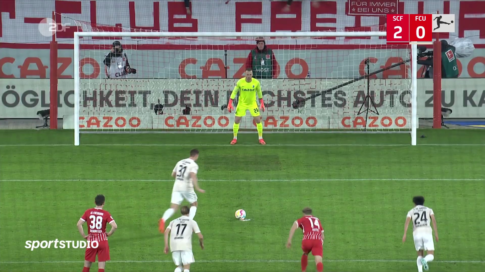
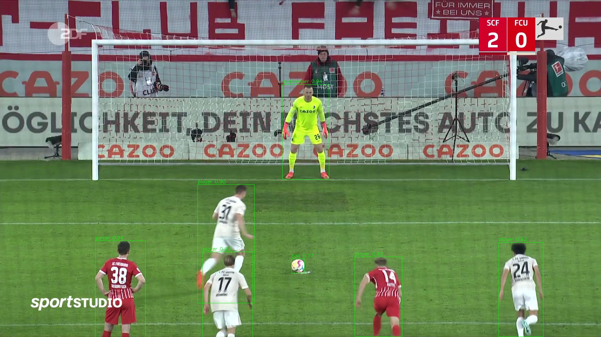

# KI-Modell zur Object Detection in Fußballspielen
Dieses Projekt nutzt Objekterkennung (Object Detection), um in Videosequenzen oder Bildern von Fußballspielen automatisch verschiedene Objekte wie Feldspieler, Torhüter, Schiedsrichter und den Ball zu erkennen.

## Erkennende Objekte:
	•	🧍‍♂️ Feldspielern
	•	🧤 Torhütern
	•	🧑‍⚖️ Schiedsrichtern
	•	⚽ Ball


## Welches Modell wird genutzt?
Es wurde ein eigenes Modell auf Basis des bestehenden YOLOv11-Modells trainiert.
Hierzu wurden zuvor hunderte Bilder aus einer Großzahl von verschiedenen Spielen manuell annotiert.


## Projektstruktur
```text
football-object-detection/
├── player_detection/                # Code für die Ausführung
├── frames/                          # Originalbilder
├── player_detection_results/        # Ergebnisbilder
├── README.md
```

Das trainierte Modell ist in GitHub leider nicht hochgeladen, weil es über 100 MB groß ist


## Beispielergebnisse
Original:

Ergebnis:


Im Repository wurden 5 Beispielbilder annotiert. Alle Bilder sind im Ordner "player_detection_results" zu sehen.
